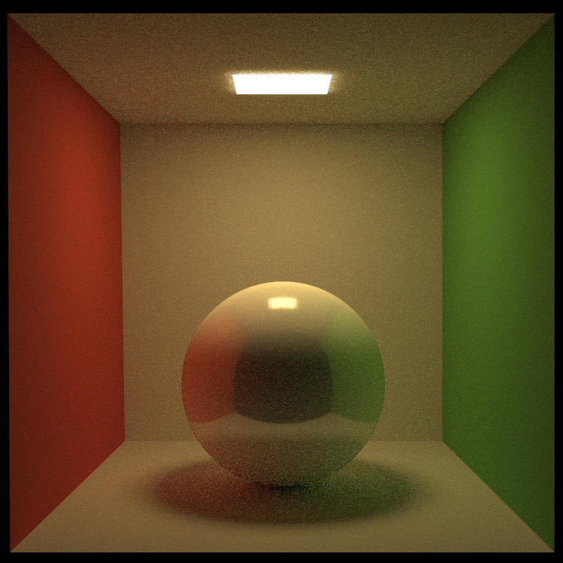
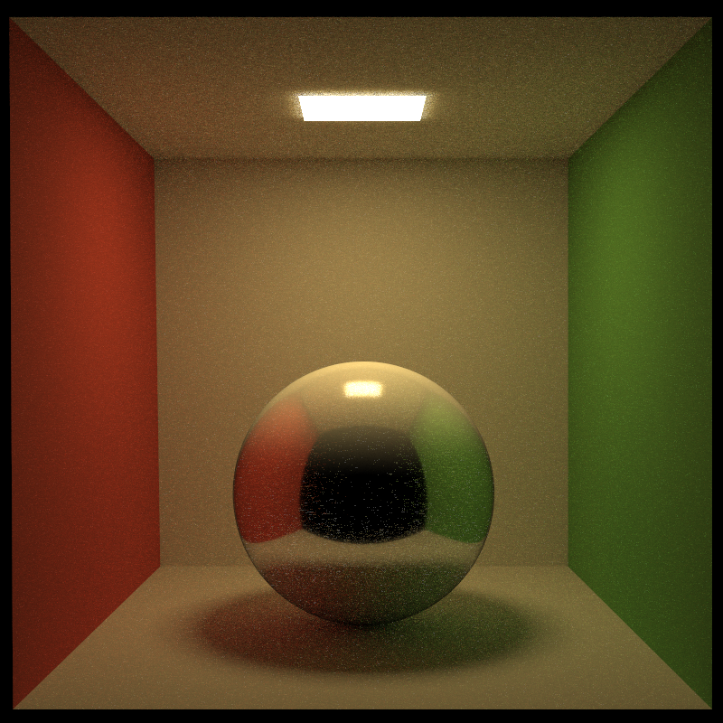
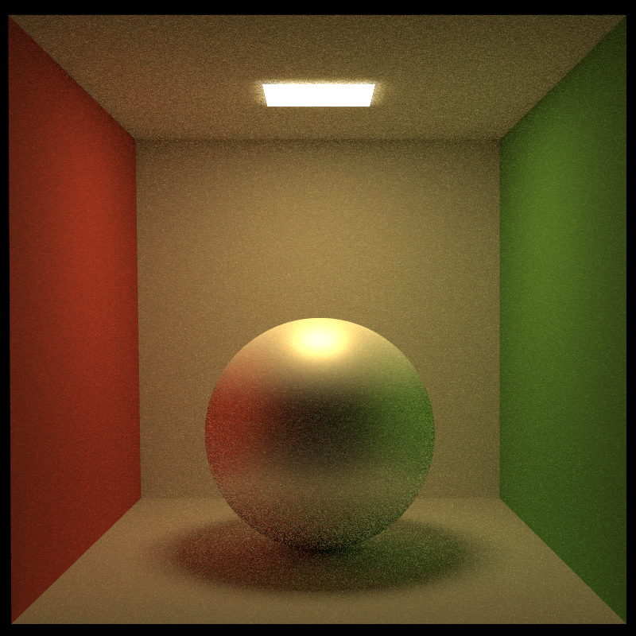
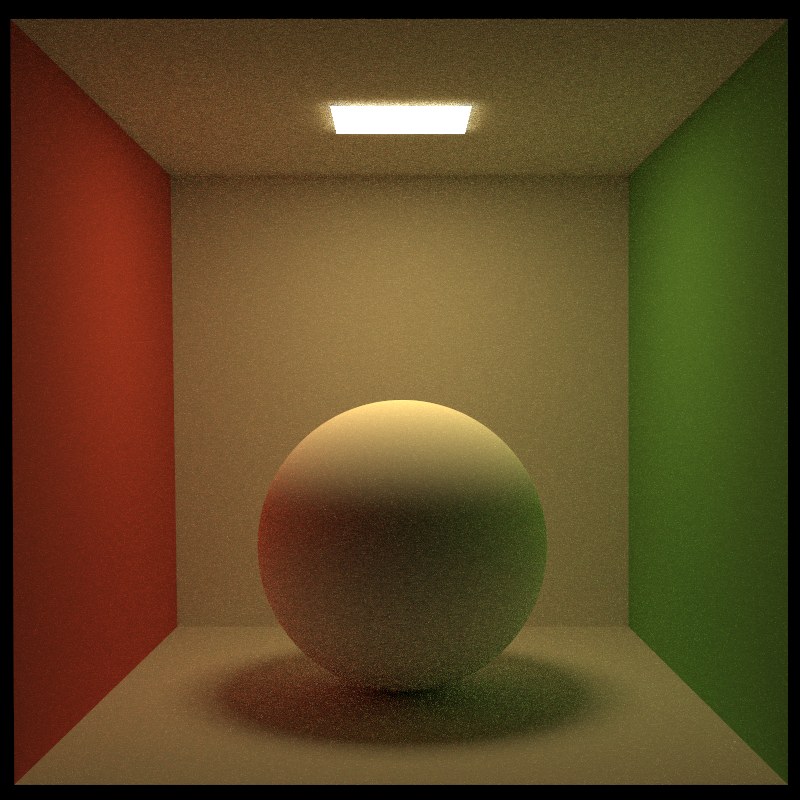

# CSC317 Showcase: Monte Carlo Path Tracer

Modified based on [Assignment 3: Ray Tracing](https://github.com/ohnooj/computer-graphics-ray-tracing), but rewrote most of the codes.

## Features

- Monte Carlo path tracing. ([`path_tracing.cpp`](src/path_tracing.cpp))
  - With Russian Roulette method.
- Multiple importance sampling. ([`path_tracing.cpp`](src/path_tracing.cpp) & [`brdf.cpp`](src/brdf.cpp))
  - Explicit light sampling.
  - BSDF importance sampling (Both of cosine-weighted hemisphere distribution and GGX distribution).
- Physically-based BRDF (Cook-Torrance Model). ([`brdf.cpp`](src/brdf.cpp))
- BVH Accelerated. ([`bvh/AABBTree.cpp`](src/bvh/AABBTree.cpp) & [`bvh/AABB.cpp`](src/bvh/AABB.cpp))
- Texture mapping. ([`material/texture.h`](src/material/texture.h))
- Normal mapping. ([`path_tracing.cpp`](src/path_tracing.cpp))
- Anti-alising by dithering sensor pixels. ([`Camera.cpp`](src/Camera.cpp))
- Gamma correction. ([`main.cpp`](src/main.cpp) & [`reader/gamma_transform.h`](src/reader/gamma_transform.h))
- Loading objects and materials from OBJ and MTL files. ([`reader/read_obj.cpp`](src/reader/read_obj.cpp))

## Improvements

- Parallelized with OpenMP.
- Better Polymorphism architecture.
  - Eliminated all `dynamic_cast`.
- Performance improvements.
  - Optimized ray-object intersection by pre-computing data and Möller–Trumbore intersection algorithm.
  - Replaced `std::shared_ptr` with `std::unique_ptr` or raw pointer where possible.
  - Replaced 64-bit `double` with 32-bit `float` for floating point data.
  - Utilized Eigen's vectorized operations and lazy evaluation where possible.
- Modernized the code based on C++20 standard.

## TODO

- DOF

## Rendered Images

### Comparing Parametric Materials

| | Metallic = 0.0 | Metallic = 0.5 | Metallic = 1.0 |
| --- | :---: | :---: | :---: |
| Roughness = 0.1 |  |  |  |
| Roughness = 0.5 |  |  |  |
| Roughness = 1.0 |  |  |  |

## Acknowledgements

### Libraries

- [Eigen](https://gitlab.com/libeigen/eigen)
- OpenMP: For parallelization.
- [libigl](https://github.com/libigl/libigl): For loading STL files.
- [tinyobjloader](https://github.com/tinyobjloader/tinyobjloader): For loading OBJ and MTL files.
- [stb](https://github.com/nothings/stb): For reading and writing images.
- [json](https://github.com/nlohmann/json): For parsing JSON files.

### Assets

- Morgan McGuire's [Computer Graphics Archive](https://casual-effects.com/data)
- [Poly Haven](https://polyhaven.com/)

### Materials

Monte Carlo path tracing: https://sites.cs.ucsb.edu/~lingqi/teaching/resources/GAMES101_Lecture_15.pdf

Multiple Importance Sampling: https://computergraphics.stackexchange.com/questions/5152/progressive-path-tracing-with-explicit-light-sampling

Cook-Torrance BRDF: https://learnopengl.com/PBR/Theory

Cosine-weighted Importance Sampling: https://ameye.dev/notes/sampling-the-hemisphere/

Importance Sampling for GGX Distribution:
- https://agraphicsguynotes.com/posts/sample_microfacet_brdf/
- https://schuttejoe.github.io/post/ggximportancesamplingpart1/

Möller–Trumbore intersection algorithm: https://en.wikipedia.org/wiki/M%C3%B6ller%E2%80%93Trumbore_intersection_algorithm
